# Random Forest Tutorial for NADA club (4.12.24)

### What is random forest analysis?

Random forest is a machine learning algorithm that combines the output of multiple decision trees into a single result. Random forest can be used for both classification and regression problems. For random forest classification the output is the class selected by most trees. For regression, the mean or average prediction of the individual trees is returned. 

So say that we have a dataset of zoo animals and we've collected all sorts of information about those animals like thier size, shape, weight, color, height, environment etc. The data we've collected becomes our training data and basis of our random forest model. We can then use decision trees to try to classify our different animals based on the training data.

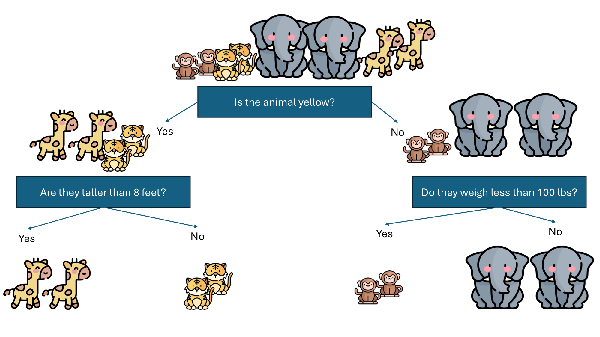

This decision tree worked really well so color, height, and weight will probably be major variables that influence our final random forest analysis. But you've probably collected more than just these three variables, so by running random forest which randomly subsets your data and makes many different decision trees (i.e., the forest), you can improve you rmodel. So another decision tree might be something like the one below with different node splits:


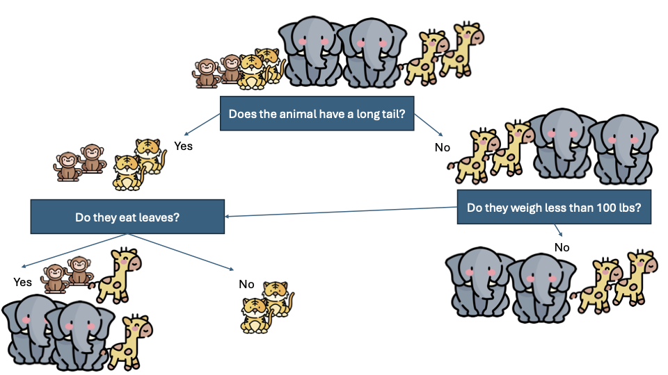

In this decision tree, separating tigers worked but not the other animals so not eating leaves is an important variable for distinguishing tigers but not other animals. Now imagine we run 1000 of these decision trees and take the most common outcome across all of them. The more informative your training data is and the more decision trees you run (up to a point), the more accurate your model should be!


### A basic random forest example using the R packages randomForest 

Say that you are looking at data generated from the oral microbiome from children that are grouped into three HIV exposure categories: 1) Children living with HIV (HI), 2) Children who were exposed to the virus in utero but are not infected with the virus (HEU), and 3) Children that were unexposed and therefore are uninfected (HUU). Typically in microbiome studies one of the first things that we can do is look at how the total community compares between individuals through some sort of ordination method (e.g., Principal coordinate analysis, multidimentional scaling plot etc). In the example below we are using a constrained ordination method called CAP (Constrained Analysis of Principal Coordinates) which uses a prior hypothesis (here, the oral microbiome between our groups will be different) to produce the ordination.

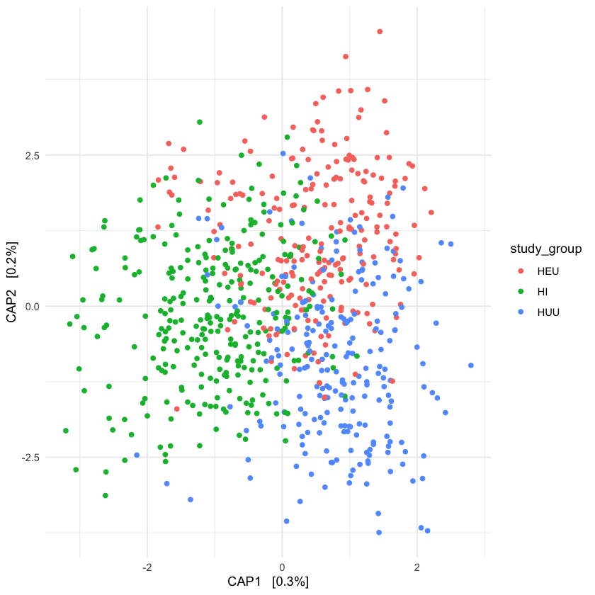

There is a lot of overlap and the total proportion of variance described by each axis is very small (0.3 & 0.2%) but nevertheless if we perform a test of significance (PERMANOVA) the differences between groups is significant (p = 0.001). But this doesn't give us much information about *how* they compare to one another (or why they are different). There are many different ways to get more information beyond qualitative ordination plots but one way that I like is through random forest analysis. 

Let's get the data first
```sh
wget https://raw.githubusercontent.com/sacrull/Random_Forest/main/sequence_table.filt.txt
wget wget https://raw.githubusercontent.com/sacrull/Random_Forest/main/map.filt.txt
```
So to start, let's install and load the random forest package
```R
# install required packages 
install.packages("randomForest")
# load into R
library(randomForest)
```

We also need to load an ASV frequency table that has the number of times a particular ASV (or bacterial taxa) is observed in each sample as well as a metadata file that corresponds to each sample

```R
asv_tab <- read.table("sequence_table.filt.txt", sep="\t", header=T, row.names=1, stringsAsFactors=F, comment.char="")
metadata <- read.table("map.filt.txt", sep="\t", header=T, row.names=1, stringsAsFactors=T, comment.char="")
```

Take a look at the metadata file -- we are going to run random forest to predict the classification accuracy of the "study_group" category, but you can run this wil any of the variables you want

```R
head(metadata)
```

Convert our ASV table from raw counts to relative abundance

```R
asv_tab_norm <- sweep(asv_tab, 2, colSums(asv_tab), '/')*100
# normalize the data so that priority is not given to any one particular feature (i.e., ASV)
asv_tab_scale <- scale(asv_tab_norm, center=T, scale=T)
# convert to data frame
asv_tab_var <- data.frame(asv_tab_scale)
# remove any nas 
asv_tab_var <- asv_tab_var[, colSums(is.na(asv_tab_var)) == 0]
```

IMPORTANT! There is an element of randomness in any machine learning algorithm (including random forest) so be sure to set a random seed so that when you rerun the code you get the same result every time.

```R
set.seed(151) # this can be any number
```

Now we need to add our metadata category that we want to use for random forest analysis to our normalized ASV table

```R
asv_tab_var$var <- metadata[rownames(asv_tab_var), "study_group"]
head(asv_tab_var)
```

Run the random forest analysis

```R
# note, I'm only using 100 trees to make the calculation to speed up the process but usually I do 1,000 trees
rf.study_group <- randomForest(x=asv_tab_var[,1:(ncol(asv_tab_var)-1)], y=asv_tab_var$var, ntree=100, importance=T, proximity=T)
```

The output of this analysis is a confusion matrix which tells you how well the algoritm was able to *correctly* place each sample into its corresponding HIV status group

```R
rf.study_group

# Call:
#  randomForest(x = asv_tab_var[, 1:(ncol(asv_tab_var) - 1)], y = asv_tab_var$var,      ntree = 100, importance = T, proximity = T)
#                Type of random forest: classification
#                      Number of trees: 100
# No. of variables tried at each split: 54

#         OOB estimate of  error rate: 40.11%
# Confusion matrix:
#     HEU  HI HUU class.error
# HEU  92  88  44   0.5892857
# HI   24 244  26   0.1700680
# HUU  44  74 112   0.5130435
```

So now we have a bit more information that we can overlay onto our original beta diversity plot -- in terms of HIV status groups, the class error for HEU and HUU is about 50%, so about 50% of the time samples are misidentified as another group. On the other hand, children living with HIV have a class error of only 17% and are most often correctly classified as HI. What is also interesting here is the fact that in the HEU and HUU categories, they are most often misclassified as HI and not each other. 

This is all well and good, but what ASVs are the most important for making these classifications? You can get this information using varImpPlot

```R
varImpPlot(rf.study_group)
```

This gives you two dot plots showing two interrelated statistics: Mean Decrease Accuracy and Mean Decrease Gini. The mean decrease accuracy plot expresses how much accuracy the model loses by excluding each variable (here ASVs). The higher the decrease in accuracy (along the X axis), the more important the variable is. Mean decrease in gini coefficient is a measure of how each variable contributes to the homogenity of the nodes and leaves in the resulting random forest. For both, however, the higher the value, the higher the importance of the variable in the model. 

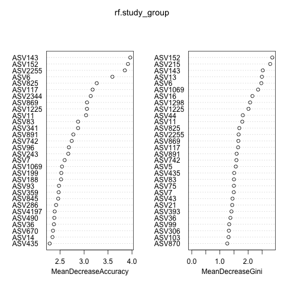

So here, the three most important ASVs in the MDA plot are:

1. ASV143, Eubacterium yurii
2. ASV152, Leptotrichia sp. oral taxon 223
3. ASV2255, Prevotella intermedia

And the three most important ASVs in the MDG plot are:

1. ASV152, Leptotrichia sp. oral taxon 223
2. ASV215, Leptotrichia sp. oral taxon 225
3. ASV143, Eubacterium yurii

What this *doesn't* tell you is directionality! And without prior expectations of what variables (here bacteria) are important in your different groups, it can be really difficult to explain how they contribute. Luckily there are post-hoc analyses you can do with random forest models that give you a better sense of how different variables contribute, which is where measures like Shapley values come in :)

### Shapley Values

Shapley values are a way relative impact of each feature we're measuring on the eventual output of the machine learning model by comparing the relative effect of the inputs against the average. We can use shapley values to get a sense of direction and how the variables impact the random forest outcome.

```R
# install.packages("kernelshap")
# install.packages("ranger")
# install.packages("vip")
# devtools::install_github("ModelOriented/shapviz")
# install.packages("reshape2")

library(ranger) #random forest package
library(kernelshap) #shapley
library(vip)
library(shapviz)
library(reshape2)
library(ggplot2)
```

We are going to subset our data to only include the variables from the first random forest model that was generated since computing shapley values is computationally intensive. 
```R
ra.study_group <- ranger(var ~ ASV143+ASV152+ASV2255+ASV6+ASV825+ASV117+ASV2344+ASV869+ASV1225+ASV11, data = asv_tab_var, scale.permutation.importance = TRUE, importance = 'permutation')
ra.study_group
# Ranger result

# Call:
#  ranger(var ~ ASV143 + ASV152 + ASV2255 + ASV6 + ASV825 + ASV117 +      ASV2344 + ASV869 + ASV1225 + ASV11, data = asv_tab_var, scale.permutation.importance = TRUE,      importance = "permutation")

# Type:                             Classification
# Number of trees:                  500
# Sample size:                      748
# Number of independent variables:  10
# Mtry:                             3
# Target node size:                 1
# Variable importance mode:         permutation
# Splitrule:                        gini
# OOB prediction error:             48.93 %
ra.study_group$confusion.matrix
#      predicted
# true  HEU  HI HUU
#   HEU  55  55 114
#   HI   15 200  79
#   HUU  43  60 127
#variable importance
pdf("./ra.importance.pdf")
vip(ra.study_group, title = "Variable Importance")
dev.off()
ranger::importance(ra.study_group) #gives the value for each variable
```
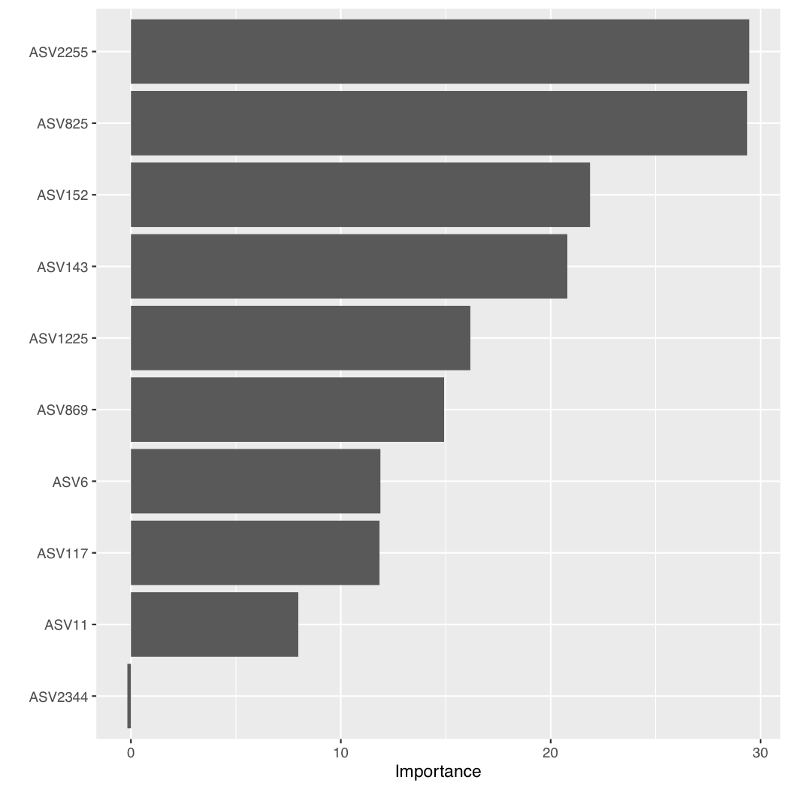

Now that we have the random forest model we can start getting shapley values. This will take awhile.
```R
s <- kernelshap(ra.study_group,
                X =asv_tab_var[ , c("ASV143", "ASV152", "ASV2255", "ASV6", "ASV825", "ASV117", "ASV2344", "ASV869", "ASV1225", "ASV11")],
                bg_X = asv_tab_var) # small dataset, can see all of them
load("test.RData")
sv <- shapviz(s) #convert to shapviz object
```
Now lets find the directionality
First what features are the most important for HUU, HEU, and HI?
```R
pdf("shap_overall_import.pdf")
sv_importance(sv, show_numbers = TRUE)
dev.off()
pdf("shap_HUU_import.pdf")
sv_importance(sv$HUU, show_numbers = TRUE)
dev.off()
```
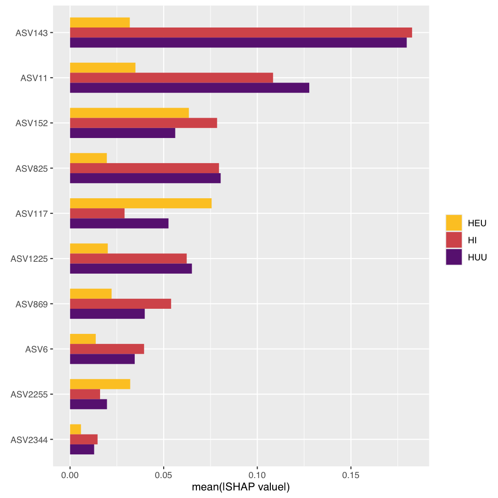
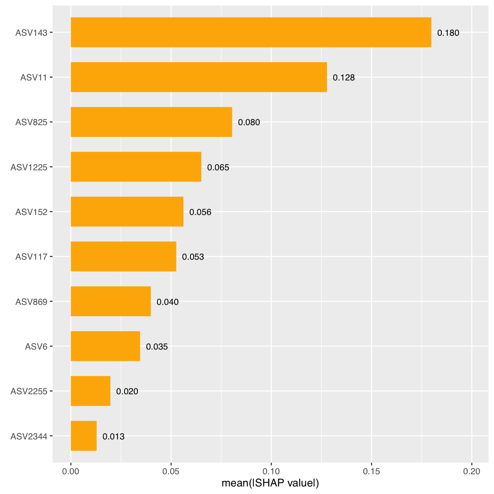

Looks like ASV 143 is an important predictor of if a sample is HUU or HI. Comparetively ASV117 is more important for determining if a sample is HEU. Now that we know which ones are important, let's find out how they influence the random forest. 
```R
pdf("shaple_values_all.pdf", width =20)
sv_importance(sv, kind = "bee")
dev.off()
```
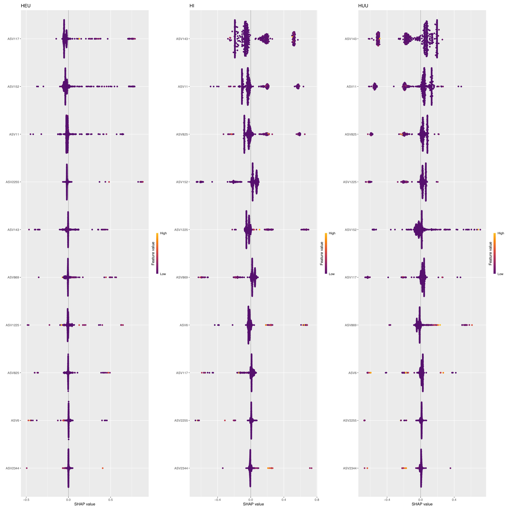

These plots are a little hard to read, so why don't we look at specifc variables in them.
```R
import_feature <- c("ASV143", "ASV11")
pdf("feature_values.pdf", height =30 , width =30)
sv_dependence(sv, v = import_feature)
dev.off()
pdf("feature_values_HI.pdf")
sv_dependence(sv$HI, v = "ASV2344")
dev.off()
```
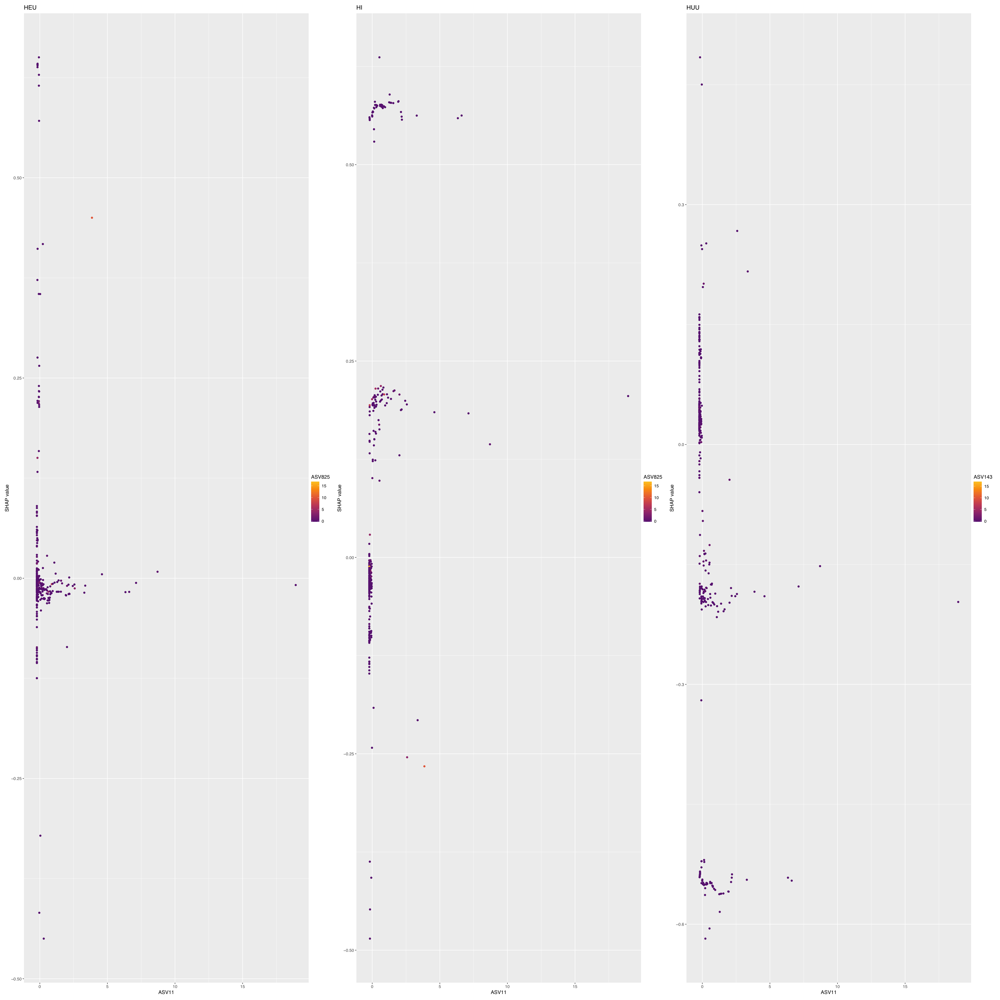

I have trouble telling directionality in some of these so why don't we make our own plots and add a trend line? We will do this for just HUU
```R
df1 <- cbind(melt(get_feature_values(sv$HUU)), melt(as.data.frame(get_shap_values(sv$HUU))))
colnames(df1)[2] <- "feature_value"
colnames(df1)[4] <- "shap_value"
df1 <- df1[, c(1,2,4)]

import_feature <- c("ASV143", "ASV11", "ASV2344")
df2 <- df1[df1$variable %in% import_feature,]
pdf("shap_feat.pdf",height = 20, width =20)
ggplot(df2, aes(feature_value, shap_value)) +
  geom_point() +
  geom_smooth(method = lm, se = TRUE)+
  facet_wrap(~factor(variable, import_feature), scales ="free")+
  theme_minimal()
dev.off()
```
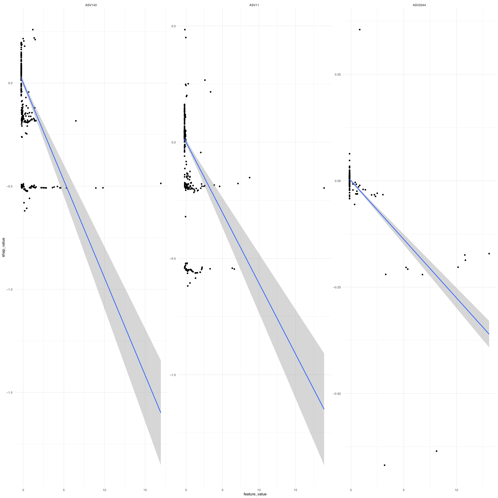

Now that we have an idea about directionality, I am interested in a particular sample to see how the model decided what category it belongs to.
```R
pdf("sample1_decomp_all.pdf", height =20, width =20)
sv_force(sv, row_id = 1)
dev.off()
pdf("sample1_decomp.pdf", height =20, width =20)
sv_waterfall(sv$HUU, row_id = 1)
dev.off()
```
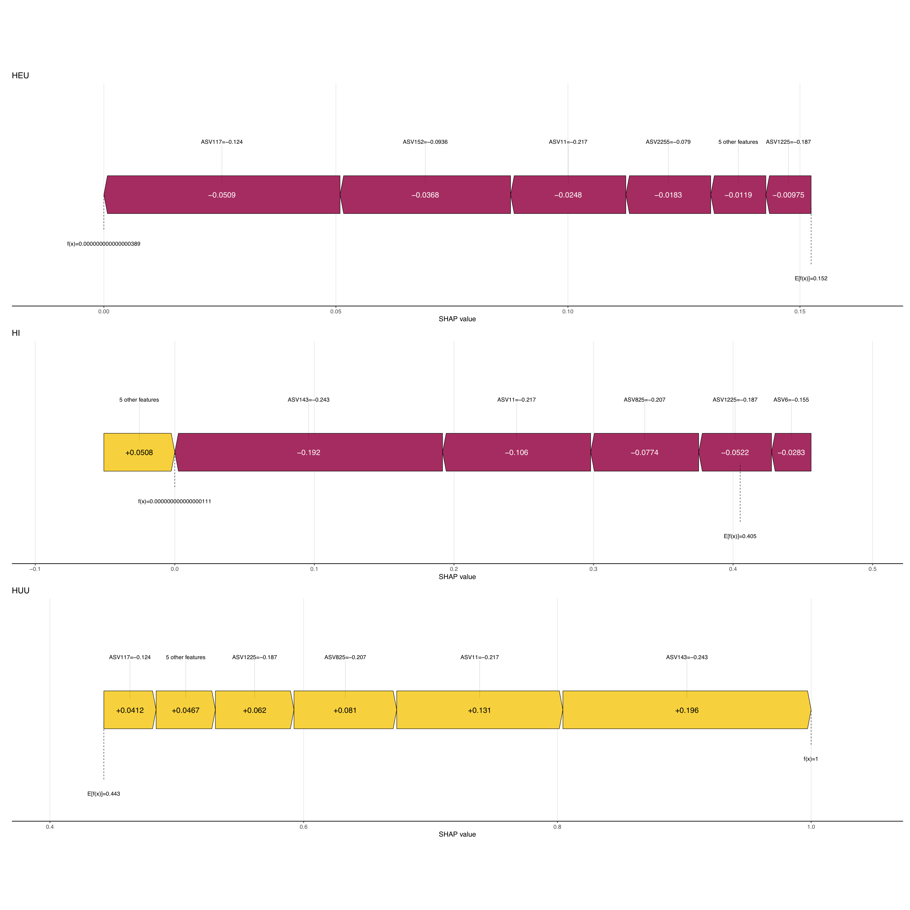
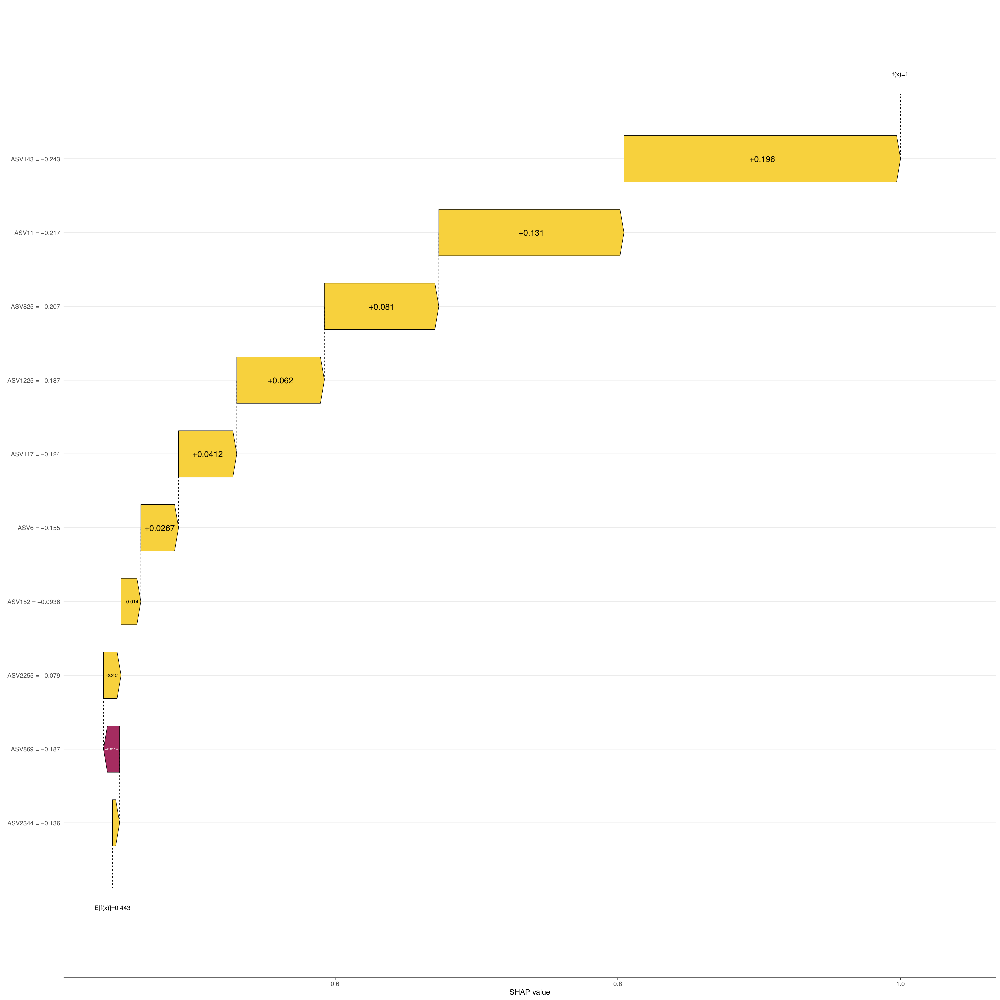

Here is an excellent tutorial to follow for more indepth infromation
https://www.css.cornell.edu/faculty/dgr2/_static/files/R_html/CompareRandomForestPackages.html


# Fun extra command
Convert pdf to pngs on mac:
```sh
for i in *.pdf; do
  name=$i;
  name=${name%.*};
  sips -s format png $i --out ${name}.png;
done
```